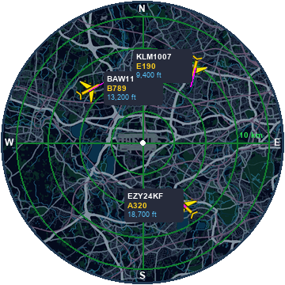
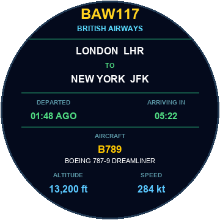

<div align="center">

# EchoEar Flight Radar

A self-contained ESPHome flight radar for the EchoEar, with live aircraft
tracking, interactive flight details, and a local map display.

[](https://esphome.io/)
[](https://github.com/moryoav/echoear-flight-radar/actions/workflows/validate.yml)
[](LICENSE)

</div>

<p align="center">
  
  
</p>

<p align="center"><sub>Illustrative traffic and flight details. Map data (c) OpenStreetMap contributors.</sub></p>

## What it does

- Polls nearby aircraft from the free adsb.fi feed every five seconds.
- Animates aircraft smoothly at a 100 ms display interval between network updates.
- Draws heading-oriented PNG aircraft icons, speed vectors, range rings, labels,
  and optional runways on the EchoEar's 360 x 360 round display.
- Switches among range-aligned, label-free OpenStreetMap backgrounds for the
  5, 10, 15, and 25 km views.
- Opens a flight details screen when the aircraft icon or its label is tapped.
- Shows callsign, airline, route, elapsed/remaining time, aircraft type,
  altitude, and speed; tapping again or waiting 60 seconds returns to radar.
- Fetches aircraft and route metadata asynchronously so tapping is immediate.
- Optionally requests authoritative departure and arrival times from FlightAware
  AeroAPI only after a flight is selected. It also fills missing route and airline
  metadata from FlightAware; estimated time values are prefixed with `~`.
- Exposes range, units, runway visibility, backlight, touch inputs, battery, and
  diagnostics as native Home Assistant entities.

HTTP runs in a dedicated ESP-IDF worker. The display and ESPHome main loop only
receive bounded handoffs, avoiding long TLS requests on the UI path.

## Hardware

This configuration is built and tested for the **Espressif EchoEar v1.1**:

| Component | Configuration |
| --- | --- |
| MCU | ESP32-S3, 240 MHz |
| Flash / PSRAM | 32 MB flash, 16 MB octal PSRAM |
| Display | 360 x 360 round LCD, `JC3636W518V2` ESPHome model |
| Touch | CST816S over I2C |
| Controls | Capacitive top pads and GPIO0 side button |
| Power | Battery reporting, switched 3.3 V rail, PWM backlight |

The microphone and speaker are intentionally inactive in this version. See the
[Espressif EchoEar documentation](https://docs.espressif.com/projects/esp-dev-kits/en/latest/esp32s3/echoear/index.html)
for board and flashing information.

## Requirements

- EchoEar v1.1
- Home Assistant with a correctly positioned `zone.home`
- ESPHome 2026.7.3 or newer; 2026.8.0 is tested
- A 2.4 GHz Wi-Fi network with internet access
- Python and Pillow only if generating a custom map
- Optional FlightAware AeroAPI key for authoritative flight times

No Home Assistant helpers or `configuration.yaml` changes are required.

## Install

### 1. Get the files

Clone the repository on a computer that has ESPHome installed:

```bash
git clone https://github.com/moryoav/echoear-flight-radar.git
cd echoear-flight-radar
```

For the Home Assistant ESPHome add-on, place these items in `/config/esphome`:

```text
echoear-flight-radar.yaml
assets/
components/
secrets.yaml
```

The YAML file, `assets`, and `components` must remain beside each other because
the configuration uses relative paths.

### 2. Configure credentials

Create `secrets.yaml` from the example:

```bash
cp secrets.example.yaml secrets.yaml
```

Set your Wi-Fi values. `aeroapi_key` may remain empty; live tracking and flight
details still work, but departure and arrival durations will be estimates when
no authoritative time is available.

Do not commit `secrets.yaml`. It is excluded by `.gitignore`.

### 3. Configure location and time zone

Home Assistant supplies the live radar center from `zone.home`. Update the
substitutions near the top of `echoear-flight-radar.yaml`:

```yaml
substitutions:
  timezone: "Europe/London"
  map_center_latitude: "51.4700"
  map_center_longitude: "-0.4543"
```

The map center must match `zone.home` within approximately 200 meters. The
bundled example map is centered on London Heathrow; generate your own map for
another location before flashing.

### 4. Generate the local map

Install the map dependency and run the generator with the same coordinates:

```bash
python -m pip install -r requirements-map.txt
python tools/generate_map.py \
  --lat 51.4700 \
  --lon -0.4543 \
  --all-ranges \
  --output-dir assets
```

The script queries OpenStreetMap through Overpass and creates four label-free
360 x 360 PNGs aligned to the firmware's 5, 10, 15, and 25 km radar
projections. The firmware switches backgrounds immediately when the range
entity changes. Regenerate the complete set whenever the map center changes.

The generated files are `flight_radar_map_5km.png`,
`flight_radar_map_10km.png`, `flight_radar_map_15km.png`, and
`flight_radar_map_25km.png`. Large Overpass requests can take several minutes;
rerun the command if all four files are not produced.

The public example contains Heathrow's two runway definitions. To draw runways
for another airport, update the `RUNWAYS` array in the display lambda or turn
off the **Flight Radar Show Runways** entity in Home Assistant.

### 5. Validate and flash

Validate before connecting the device:

```bash
esphome config echoear-flight-radar.yaml
```

For the first installation, connect the EchoEar over USB and flash it. Replace
the device name with the serial port used by your system:

```bash
# Windows example
esphome run echoear-flight-radar.yaml --device COM4

# Linux example
esphome run echoear-flight-radar.yaml --device /dev/ttyACM0
```

After the first flash, updates can be installed over Wi-Fi:

```bash
esphome run echoear-flight-radar.yaml --device echoear-flight-radar.local
```

Home Assistant should discover the device after it connects. Add it through
**Settings > Devices & services**, then verify that `zone.home` reaches the
device through the ESPHome API.

## Controls

| Action or entity | Result |
| --- | --- |
| Tap aircraft icon or label | Open the selected flight details |
| Tap while viewing details | Return to the radar |
| 60 seconds without input | Return to the radar automatically |
| Flight Radar Range | Select 5, 10, 15, or 25 km |
| Flight Radar Units | Select kilometers or miles |
| Flight Radar Show Runways | Toggle compiled runway overlays |
| Screen | Adjust display backlight |
| Restart | Reboot the device |

## Data flow

| Service | When used | Data sent |
| --- | --- | --- |
| [adsb.fi](https://opendata.adsb.fi/) | Every five seconds | Home coordinates and radius |
| [ADSBDB](https://www.adsbdb.com/) | As aircraft enter the local set | ICAO hex or callsign |
| [FlightAware AeroAPI](https://www.flightaware.com/aeroapi/) | On tap, when a key is configured | Selected callsign and, only when needed, its operator code |

API responses are handled on-device. No companion server, Home Assistant
automation, or helper entity is needed. Provider availability and data quality
vary. ADSBDB metadata remains preferred, while FlightAware fills missing route
or airline fields and the display falls back to marked time estimates when no
authoritative times are available.

## Project layout

```text
echoear-flight-radar.yaml          Main ESPHome configuration and UI
assets/                            Plane icon and four generated range maps
components/async_flight_radar/     ESP-IDF asynchronous HTTPS worker
tools/generate_map.py              OpenStreetMap multi-range map generator
tools/render_readme_screenshots.py Reproducible documentation images
docs/                              README screenshots
```

## Troubleshooting

**The radar says `NO HOME`**

Confirm Home Assistant is connected through the ESPHome API and that
`zone.home` has latitude and longitude attributes.

**Aircraft appear but the map does not**

Make sure all four generated map files exist and the YAML map-center
substitutions match `zone.home`. A mismatch intentionally disables the static
maps at every range.

**Flight times still start with `~`**

The value is an estimate. Confirm the AeroAPI key is present, then check the
FlightAware status and HTTP diagnostic entities. Not every callsign resolves
to a current AeroAPI flight record.

**The display updates but aircraft jump**

Check Wi-Fi quality and the radar fetch diagnostics. Aircraft positions are
interpolated continuously, but fresh ADS-B positions still depend on the
five-second upstream polling cycle.

## Credits and license

The project was inspired by
[MatixYo/ESP32-Plane-Radar](https://github.com/MatixYo/ESP32-Plane-Radar),
featured by [Hackaday](https://hackaday.com/2026/07/08/esp32-keeps-tabs-on-your-local-airspace/).
See [NOTICE.md](NOTICE.md) for data-provider and OpenStreetMap attribution.

Released under the [MIT License](LICENSE).
